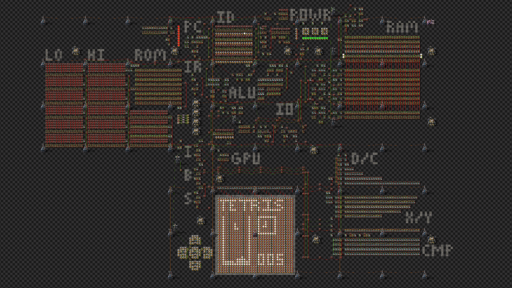

# Factorio Processor V5

A completely custom, target designed CPU architecture for Factorio.



### Design Goals

The primary design goal is to create a processor that utilizes the unique restrictions and architecture of Factorio combinator logic to the best extent. This means dropping traditional processor architecture standards in favor of architecture that is easier to do in Factorio. With that in mind, the goals for this processor are:

 - A single stage instruction execution model, to reduce the need for pipelining and speed up processor execution.
 - Very few internal registers, no general purpose register file. Since memory in Factorio has no significant costs compared to internal registers, design a processor that interacts directly with memory. This improves the CPI, allowing us to fit more complexity in fewer instructions.
 - CISC style instruction set, allowing more complex operations within single instructions. Since the Factorio processor's clock will by necessity be very slow, having an instruction set that reduces code is important.
 - Improvements on the components used. Fully utilizing advanced techniques learned over several iterations of this concept, EACH, EVERYTHING and ALL signals, and idiomatic Factorio combinator design to squeeze the maximum possible capabilities out of the current architecture.

*Aside: This architecture is V5, as it is the fifth iteration in a Factorio specific processor architecture. V1, V3, and V4 never progressed past the prototype stage, and V2 (my first working Factorio CPU) can be found [here](https://github.com/alcatrazEscapee/factorio-assembler).

### System Specs

 - 32 bit Word Length
 - 64 bit Instructions
 - 60 KB (7,680 x 64b) Instruction Memory (ROM)
 - 4 KB (1,024 x 32b) Main Memory (RAM), capable of up five concurrent reads and one write operation.
 - ~2 Hz Clock (at 1x speed)
 - 0.2 - 1 CPI, based on instruction makeup.
 - Implementation uses 1.2k Lamps, 1.1k Constant Combinators, 1.1k Decider Combinators, and 767 Arithmetic Combinators.

## Instruction Set

The instruction set was designed with a few things in mind:

 - Due to the lack of locality costs, all instructions interact directly with memory.
 - Factorio supports a wide range of fast, native ALU operations, and that can be taken advantage of to reduce instruction counts.
 - The large (64-bit) instruction size allows using 26-bit immediate values in both ALU, and branch instructions.

### Instruction Layout

**Addressing Modes:**

 - **Constant:** `@<int>`, where `<int>` is an integer in the range `[0, 1024)`. This corresponds to the `<int>`th word of memory.
 - **Indirect:** `@@<int>`, where `<int>` is an integer in the range `[0, 1024)`. This references the value, treating the `<int>`th word as a memory address.
 - **Indirect + Offset** `@@<int1>.<int2>`. This is the most complex addressing mode. It is a constant offset of `<int2>` from the previous addressing mode. `<int1>` can be in the range`[0, 1024)`, and `<int2>` can be in the range `[-16, 15]` (5 bit 2's compliment signed).

In order to accomplish the above addressing modes, a single operand consists of a 16-bit field in the instruction:

```
[10b Address (A)][5b Offset (F)][1b Indirect Flag (X)]
```

- If `X = 1` then `@@A.F`
- If `X = 0` then `@A` (`F` should always be zero in this mode, as all reachable address space can be used with `A`)
    `@@A` addressing is achieved with `F = 0` and `X = 1`

In addition, there are several aliases for specific memory values, which are utilized in the assembly language to enforce code standards:
 - `sp` = `@1023`, the stack pointer.
 - `ra` = `@1022`, the return address.
 - `rv` = `@1021`, the return value.
 - `r0` = `@0`, the zero register (the memory value here is intentionally unimplemented).
 - `r1`, `r2`, ... `r16`, aliased to the memory values immediately after `r0`, which are meant to emulate typical processor registers.

*Implementation Note:* As Factorio does not support 64-bit integers, the instruction memory and `IR` register are implemented in two parallel 32-bit memories (`HI` and `LO`), which when laid out, comprise the full instruction.

**Instruction Types**

**Type A:** Three Operand

`[Opcode - 6b][Unused - 10b][Operand 1 - 16b] | [Operand 2 - 16b][Operand 3 - 16b]`

- Operand 1 = Y
- Operand 2 = X
- Operand 3 = Z

**Type B:** Two Operand Immediate

`[Opcode - 6b][Immediate - 26b] | [Operand 2 - 16b][Operand 3 - 16b]`

- Operand 2 = X
- Operand 3 = Y
- Immediate = #Z

**Type C:** Two Operand Offset

`[Opcode - 6b][Unused - 10b][Operand 1 - 16b] | [Branch Offset - 16b][Operand 3 - 16b]`

- Operand 1 = Y
- Operand 3 = X

**Type D:** Operand Immediate Offset

`[Opcode - 6b][Immediate - 26b] | [Branch Offset - 16b][Operand 3 - 16b]`

- Operand 3 = X
- Immediate = #Y

**Type E:** Special Instruction

`[Opcode - 6b][Unused - 26b] | [Unused - 32b]`

- No fields, used for `ret`, `halt`, etc.

**Type F:** GPU Instruction

`[Opcode - 6b][GPU Opcode - 3b][Function - 4b][Unused - 3b][Field 1 - 16b] | [Unused - 16b][Field 2 - 16b]`

- `Field 1` and `Field 2` may be interpreted as immediate values (`glsi`, `gmvi`), or references to main memory as memory operands (`gls`, `gmv`)
- The `Function` field is the function used by `gcb` and `gci`, as the "GPU Function" input, and by `glsd` as the "Image Decoder" input.

### Instruction Table

Note: the below instruction tables represent a hardware view of the instructions. Some of these instructions are not implemented in the assembler (all reverse instructions, for example). Additionally, the assembler implements more instructions than are present in the hardware, which are then translated down into this set of hardware instructions.

| ID  | Instruction                    | Assembly            | Operation           |
|-----|--------------------------------|---------------------|---------------------|
| 0   | Add                            | `add X, Y, Z`       | `X <- Y + Z`        |
| 1   | Subtract                       | `sub X, Y, Z`       | `X <- Y - Z`        |
| 2   | Multiply                       | `mul X, Y, Z`       | `X <- Y * Z`        |
| 3   | Divide                         | `div X, Y, Z`       | `X <- Y / Z`        |
| 4   | Power                          | `pow X, Y, Z`       | `X <- Y ** Z`       |
| 5   | Modulo                         | `mod X, Y, Z`       | `X <- Y % Z`        |
| 6   | Bitwise AND                    | `and X, Y, Z`       | `X <- Y & Z`        |
| 7   | Bitwise OR                     | `or X, Y, Z`        | `X <- Y or Z`       |
| 8   | Bitwise NAND                   | `nand X, Y, Z`      | `X <- !(Y & Z)`     |
| 9   | Bitwise NOR                    | `nor X, Y, Z`       | `X <- !(Y or Z)`    |
| 10  | Bitwise XOR                    | `xor X, Y, Z`       | `X <- Y ^ Z`        |
| 11  | Bitwise XNOR                   | `xnor X, Y, Z`      | `X <- !(Y ^ Z)`     |
| 12  | Left Shift                     | `ls X, Y, Z`        | `X <- Y << Z`       |
| 13  | Right Shift                    | `rs X, Y, Z`        | `X <- Y >> Z`       |
| 14  | Compare Equal                  | ` eq X, Y, Z`       | `X <- Y == Z`       |
| 15  | Compare Not Equal              | `ne X, Y, Z`        | `X <- Y != Z`       |
| 16  | Compare Less Than              | `lt X, Y, Z`        | `X <- Y < Z`        |
| 17  | Compare Less Than or Equal     | `le X, Y, Z`        | `X <- Y <= Z`       |
| 18  | Add Immediate                  | `addi X, Y, #Z`     | `X <- Y + #Z`       |
| 19  | Subtract Immediate Reverse     | `subir X, Y, #Z`    | `X <- #Z - Y`       |
| 20  | Multiply Immediate             | `muli X, Y, #Z`     | `X <- Y * #Z`       |
| 21  | Divide Immediate               | `divi X, Y, #Z`     | `X <- Y / #Z`       |
| 22  | Divide Immediate Reverse       | `divir X, Y, #Z`    | `X <- #Z / Y`       |
| 23  | Power Immediate                | `powi X, Y, #Z`     | `X <- Y ** #Z`      |
| 24  | Power Immediate Reverse        | `powir X, Y, #Z`    | `X <- #Z ** Y`      |
| 25  | Modulo Immediate               | `modi X, Y, #Z`     | `X <- Y % #Z`       |
| 26  | Modulo Immediate Reverse       | `modir X, Y, #Z`    | `X <- #Z % Y`       |
| 27  | Bitwise AND Immediate          | `andi X, Y, #Z`     | `X <- Y & #Z`       |
| 28  | Bitwise OR Immediate           | `ori X, Y, #Z`      | `X <- Y or #Z`      |
| 29  | Bitwise NAND Immediate         | `nandi X, Y, #Z`    | `X <- !(Y & #Z)`    |
| 30  | Bitwise NOR Immediate          | `nori X, Y, #Z`     | `X <- !(Y or #Z)`   |
| 31  | Bitwise XOR Immediate          | `xori X, Y, #Z`     | `X <- Y ^ #Z`       |
| 32  | Bitwise XNOR Immediate         | `xnori X, Y, #Z`    | `X <- !(Y ^ #Z)`    |
| 33  | Left Shift Immediate           | `lsi X, Y, #Z`      | `X <- Y << #Z`      |
| 34  | Left Shift Immediate Reverse   | `lsir X, Y, #Z`     | `X <- #Z << Y`      |
| 35  | Right Shift Immediate          | `rsi X, Y, #Z`      | `X <- Y >> #Z`      |
| 36  | Right Shift Immediate Reverse  | `rsir X, Y, #Z`     | `X <- #Z >> Y`      |
| 37  | Compare Equal Immediate        | `eqi X, Y, #Z`      | `X <- Y == #Z`      |
| 38  | Compare Not Equal Immediate    | `nei X, Y, #Z`      | `X <- Y != #Z`      |
| 39  | Compare Less Than Immediate    | `lti X, Y, #Z`      | `X <- Y < #Z`       |
| 40  | Compare Greater Than Immediate | `gti X, Y, #Z`      | `X <- Y > #Z`       |
| 41  | Branch Equal                   | `beq X, Y, Label`   | Branch if `X == Y`  |
| 42  | Branch Not Equal               | `bne X, Y, Label`   | Branch if `X != Y`  |
| 43  | Branch Less Than               | `blt X, Y, Label`   | Branch if `X < Y`   |
| 44  | Branch Less Than or Equal      | `ble X, Y, Label`   | Branch if `X <= Y`  |
| 45  | Branch Equal Immediate         | `beqi X, #Y, Label` | Branch if `X == #Y` |
| 46  | Branch Not Equal Immediate     | `bnei X, #Y, Label` | Branch if `X != #Y` |
| 47  | Branch Less Than Immediate     | `blti X, #Y, Label` | Branch if `X < #Y`  |
| 48  | Branch Greater Than Immediate  | `bgti X, #Y, Label` | Branch if `X > #Y`  |
| 49  | Call                           | `call Label`        | Branch, `ra <- PC`  |
| 50  | Return                         | `ret`               | `PC <- ra`          |
| 51  | Halt                           | `halt`              | Halts execution     |
| 52  | Assert                         | `assert X = #Y`     | Asserts `X = #Y`    |
| 53  | GPU                            | Various             | Various             |
| 54  | Print                          | `print [ ... ]`     | Print Statement     |

There are also several pseudo-instructions that are supported by the assembler, but translate to existing assembly instructions. There are also alternate forms or syntax for existing instructions, which are often more intuitive than using specific instructions. These are:

| Instruction                             | Assembly            | Compiled              |
|-----------------------------------------|---------------------|-----------------------|
| Set                                     | `set X, Y`          | `add X, Y, r0`        |
| Set Immediate                           | `seti X, #Y`        | `addi X, r0, #Y`      |
| Subtract Immediate                      | `subi X, Y, #Z`     | `addi X, Y, -#Z`      |
| Compare Greater Than                    | `gt X, Y, Z`        | `lt X, Z, Y`          |
| Compare Greater Than or Equal           | `ge X, Y, Z`        | `le X, Z, Y`          |
| Compare Less Than or Equal Immediate    | `lei X, Y, #Z`      | `lti X, Y, #Z+1`      |
| Compare Greater Than or Equal Immediate | `gei X, Y, #Z`      | `gti X, Y, #Z-1`      |
| Branch Greater Than                     | `bgt X, Y, Label`   | `blt Y, X, Label`     |
| Branch Greater Than or Equal            | `bge X, Y, Label`   | `blt Y, X, Label`     |
| Branch Less Than or Equal Immediate     | `blei X, #Y, Label` | `blti X, #Y+1, Label` |
| Branch Greater Than or Equal Immediate  | `bgei X, #Y, Label` | `bgti, X, #Y-1`       |
| Subtract Immediate (Alt.)               | `subi X, #Y, Z`     | `subir X, Z, #Y`      |
| Divide Immediate (Alt.)                 | `divi X, #Y, Z`     | `divir X, Z, #Y`      |
| Power Immediate (Alt.)                  | `powi X, #Y, Z`     | `powir X, Z, #Y`      |
| Modulo Immediate (Alt.)                 | `modi X, #Y, Z`     | `modir X, Z, #Y`      |
| Left Shift Immediate (Alt.)             | `lsi X, #Y, Z`      | `lsir X, Z, #Y`       |
| Right Shift Immediate (Alt.)            | `rsi X, #Y, Z`      | `rsir X, Z, #Y`       |

The instructions `subi`, `divi`, `powi`, `modi`, `lsi`, and `rsi`, can all be used with the immediate as a second parameter in the assembler, and they will be translated their corresponding "Reverse" instruction. The exact same behavior is implemented with all branch immediate instructions, which accept their operands in either order and will adjust their operands accordingly (i.e. `bgt #Y X` is equivalent to `blt X #Y`)

## GPU Architecture

The V5 processor comes equipped with a single GPU instruction, which itself is composed of several sub-instructions, which communicate with the GPU itself. The GPU consists of a single one-color (buffered) screen, to which limited drawing, composition, and translation functions are supported.

Specification:

- A 32x32 pixel 1-color screen
- 128-Byte on-screen memory, capable of synchronous, single clock cycle writes
- Two 128-Byte buffer memories (Buffer and Image).
- 8 kB (64 x 128 Byte) GPU ROM
- Single clock cycle composition, translation operations.


### GPU Instructions

GPU Instructions all share a single opcode, and have a unique instruction type. For instructions that take a single operand (memory, or immediate), `Field 1` is used. For instructions that take two, both `Field 1` and `Field 2` are used.

| ID  | Instruction               | Assembly     | Operation                           |
|-----|---------------------------|--------------|-------------------------------------|
| 0   | Flush Buffer              | `gflush`     | `Screen <- Buffer`                  |
| 1   | Load Sprite Immediate     | `glsi #I`    | `Image <- GPU ROM[#I]`              |
| 2   | Load Sprite               | `gls X`      | `Image <- GPU ROM[X]`               |
| 3   | Load Sprite Direct        | `glsd rX S`  | `Image <- Decoder(rX, S)`           |
| 3   | Compose to Buffer         | `gcb G`      | `Buffer <- Composer(Image, G)`      |
| 4   | Compose to Image          | `gci G`      | `Image <- Composer(Image, G)`       |
| 5   | Translate Image           | `gmv X Y`    | `Image <- Translate(Image, X, Y)`   |
| 6   | Translate Image Immediate | `gmvi #X #Y` | `Image <- Translate(Image, #X, #Y)` |

#### Composition Functions

The composer is responsible for taking two image buffers (Image Buffer, and Screen Buffer), and computing a new image, which is loaded into either buffer as a result. The composition function is a per-pixel function, which determines the result. These functions are referenced by the `gcb` (Compose to Buffer) and `gci` (Compose to Image) instructions as their only parameter.

Consider the following initial setup:

- `Screen : ####....`
- `Buffer : ...##...`

| Function | Name                | Assembly                | Output     |
|----------|---------------------|-------------------------|------------|
| `0000`   | (Global) Clear      | `G_CLEAR`               | `........` |
| `0001`   | Logical NOR         | `G_NOR`                 | `.....###` |
| `0010`   | Erase               | `G_ERASE`               | `###.....` |
| `0011`   | Draw Negative       | `G_DRAW_NEGATIVE`       | `###..###` |
| `0100`   | Highlight           | `G_HIGHLIGHT`           | `....#...` |
| `0101`   | Negative            | `G_NEGATIVE`            | `....####` |
| `0110`   | Toggle              | `G_TOGGLE`              | `###.#...` |
| `0111`   | Logical NAND        | `G_NAND`                | `###.####` |
| `1000`   | Erase Negative      | `G_ERASE_NEGATIVE`      | `...#....` |
| `1001`   | Toggle Negative     | `G_TOGGLE_NEGATIVE`     | `...#.###` |
| `1010`   | No-op               | `G_NOOP`                | `####....` |
| `1011`   | Draw Negative Alpha | `G_DRAW_ALPHA_NEGATIVE` | `####.###` |
| `1100`   | Draw                | `G_DRAW`                | `...##...` |
| `1101`   | Highlight Negative  | `G_HIGHLIGHT_NEGATIVE`  | `...#####` |
| `1110`   | Draw Alpha          | `G_DRAW_ALPHA`          | `#####...` |
| `1111`   | (Global) Full       | `G_FULL`                | `########` |

## Implementation

This section describes implementation details of the V5 architecture in Factorio.

### Bus Signals

**Red (Data) Bus**
- `A` - Memory[A]
- `B` - Memory[C]
- `I` - Immediate
- `J` - PC + Offset (Branch Target)
- `P` - PC Output
- `Z` - ALU Output (Memory Data Input)

**Green (Control) Bus**
 - `A` - IR Field, Memory Operand A (Operand 1, `IR[47:32]`)
 - `B` - IR Field, Memory Operand B (Operand 2, `IR[31:16]`)
 - `C` - IR Field, Memory Operand C (Operand 3, `IR[15:0]`)
 - `D` - Branch Offset (2's Compliment Signed D)
 - `G` - GPU Flag
 - `H` - Halt Flag
 - `J` - Branch Flag (0 = None, 1 = Unconditional, 2 = Conditional on Z=1)
 - `K` - Clock
 - `L` - ALU Select (See Table)
 - `R` - Call Flag (RA <= PC)
 - `S` - PC Select (0 = PC Increment, 1 = Branch / Return (Z), 2 = ???)
 - `T` - Assert Flag
 - `U` - Reset Flag
 - `V` - Power On (Clock Enable)
 - `W` - Main Memory Write Enable
 - `X` - ALU A Input (0 = `Memory[A]`, 1 = `Memory[C]`, 2 = Immediate)
 - `Y` - ALU B Input (0 = `Memory[C]`, 1 = `Memory[A]`, 2 = Immediate)

**Green (GPU Control) Bus**

- `F` - GPU Function
- `G` - GPU Opcode (-1 = Non-GPU Instruction)
- `K` - Clock (Forwarded)
- `I` - Image Enable
- `J` - Image Select (0 = GPU ROM Out, 1 = Decoder Out, 2 = Translation Out, 3 = Composer Out)
- `S` - Screen Enable
- `U` - Buffer Enable
- `X` - Field Select (0 = Field, Immediate, 1 = Memory)

**Red (GPU Data) Bus**
- `A` Field A
- `B` Field B

**GPU Image Data Bus**

The GPU has a single bus which connects all of it's components' image data lines (up to 128-byte signals). However, as all these data lines share the same signals, they are split onto physically separate busses, which are arranged in parallel. The individual busses alternate in color, and are ordered from left to right. Even numbered bus indices are green, odd numbered indices are red.

- Bus[0] (Green 1) = Buffer Register Out
- Bus[1] (Red 1) = Image Register Out
- Bus[2] (Green 2) = GPU ROM Out
- Bus[3] (Red 2) = Image Decoder Out
- Bus[4] (Green 3) = Translation Matrix Out
- Bus[5] (Red 3) = Composer Out

Each bus line is multiplexed at the input to various components:

- Screen Register <- Buffer Register Out
- Buffer Register <- Composer Out
- Image Register <- Multiplex(GPU ROM Out, Image Decoder Out, Translation Matrix Out, Composer Out)
- Translation Matrix In <- Image Register Out
- Composer Image In <- Image Register Out
- Composer Buffer In <- Buffer Register Out

**ALU Select (L)**

| Code | Operation |
|------|-----------|
| 0    | A + B     |
| 1    | A - B     |
| 2    | A * B     |
| 3    | A / B     |
| 4    | A ** B    |
| 5    | A % B     |
| 6    | A & B     |
| 7    | A or B    |
| 8    | A ^ B     |
| 9    | A << B    |
| 10   | A >> B    |
| 11   | !(A & B)  |
| 12   | !(A or B) |
| 13   | !(A ^ B)  |
| 14   | A == B    |
| 15   | A != B    |
| 16   | A < B     |
| 17   | A > B     |
| 18   | A <= B    |
| 19   | A >= B    |

### Read Only Memory

Read Only Memory (ROM) is built with constant combinators. Each combinator can hold 20 signals of 32-bits each, resulting in a maximum memory density of 640 bits / block with a 1 x 640 bit, single word memory. However effective addressing of smaller word sizes requires combinational logic.

Key metrics:
- Total Memory (Bits, Bytes, Words)
- Word Size (Bits, Bytes)
- Memory Density (bits/m^2)

**Processor Instruction Memory**
- Tileable design, with a 6x18 tile footprint, and a single ~20x4 multiplexer block.
- Two independent 32-bit words memories together form a single 64-bit word instruction memory.
- One tile contains 4x16 constant combinators and 4x16 + 2 logical combinators.
- Currently used design uses 6 tiles for a footprint of 36x18, or two standard power cells.
- Metrics:
	- Total Memory = 60 KB = 61,440 B = 7,680 Words
	- Word Size = 8 B (64 bit)
	- (Asymptotic) Memory Density = 426 bits/m^2 (66% Optimal)
	- (Realistic) Memory Density = ~337 bits/m^2 (52% Optimal)

**GPU Implementation**

The implementation of the draw function may be thought of as a multiplexer with the screen and buffer inputs as select signals:
```verilog
case {screen, buffer} :
	00 : func[0]
	10 : func[1]
	01 : func[2]
	11 : func[3]
```

However in implementation, as each screen and buffer are packed into 32-bit integers, this is impractical. As the screen and buffer use the same signals, one needs to be re-encoded before being fed into the draw function.
```verilog
out = (~s & ~b if func[0])
    + ( s & ~b if func[1])
    + (~s &  b if func[2])
    + ( s &  b if func[3])
```

#### Decoder Functions

| Function | Width x Height | Assembly |
|----------|----------------|----------|
| 0        | 32 x 1         | `G_32x1` |
| 1        | 16 x 2         | `G_16x2` |
| 2        | 8 x 4          | `G_8x4`  |
| 3        | 4 x 8          | `G_4x8`  |
| 4        | 2 x 16         | `G_2x16` |
| 5        | 1 x 32         | `G_1x32` |

#### Screen Memory Layout
```
[32b  -  a0]
[32b  -  a1]
     ...
[32b  - a31]
```

#### Translations

Buffers can also be *positioned*, which shifts the buffer placement in the positive x and y directions.

The screen is organized so that a movement in the X direction can be done via a straightforward shift movement:
```verilog
// Move the word a by +dx
ai := a >> dx
```
Vertical movement requires a form of a barrel shifter.
- Movement is limited to `dy in [0, 31]`, so five levels, one per shift bit.
- Each level has 32 buffers (arithmetic combinators set to `X * 1`), which generate the matching output signals. 
